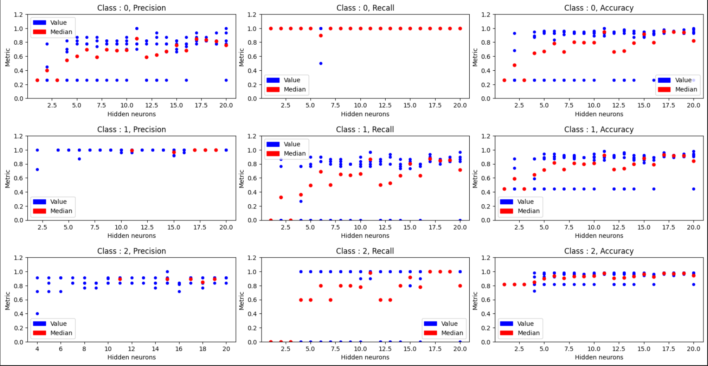
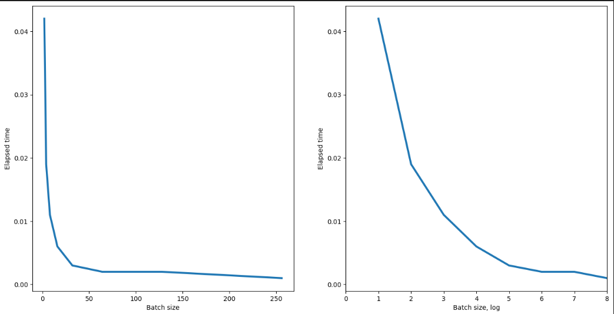
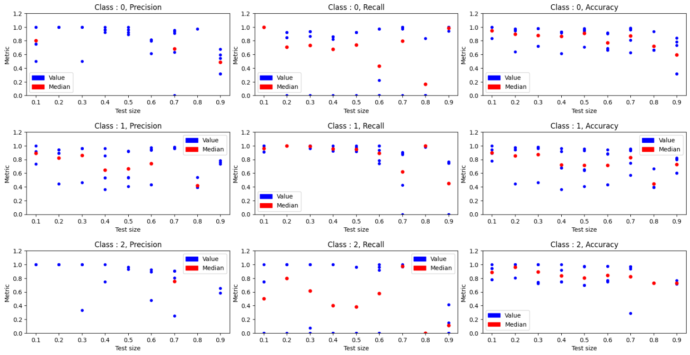

# Fully connected NN on WineNet dataset

## Sumary
In this project, studies were carried out on the dataset "WineNet".

Studying metrics of the results for classification task of a fully connected neural network (pytorch) and training time, in dependens of such parameters as:
1. The number of neurons in the hidden layer.
2. Batch size.
3. Ratio of training/test split.

## Results

### 1. The number of neurons in the hidden layer
Neural network has been trained several times with the number of neurons in the hidden layers ranging from 1 to 19, 5 times each, and then plotted the accuracy, precision and recall of each training + the median for each number of neurons in the hidden layers:

We can clearly see the tendency on almost all metrics, adding more hidden neurons in hidden layer tend to increase qualitty of classification, but to some degree. After around 15+ neurons median is not getting significantly better, as well as value spread which is not getting any lower.

### 2. Batch size

Model trainig time is heavilly dependent on batch size, if it is small - we're not using parallel computing capabilities. Neural network has been trained with batch_size = 2^t, t=0,1,2...8.

Tendency is clearly there: the bigger the batch size the faster model trains. Limitations are amount of memory.

On the log scale plot however, we can see that function is not liniar, as i expected.

### 3. Ratio of training/test split

Neural network has been trained with 10 neurons in hidden layer with train/test split ranging from 0.1 to 0.9, 5 times each.

With a strong increase in test size, the train dataset size decreases and accuracy of metrics falls. I expected the effect to show up sooner rather than at >0.6, 0.7. We can see that with such a dataset size, from median point of view, 0.2-0.3 is good choice for size of test dataset.